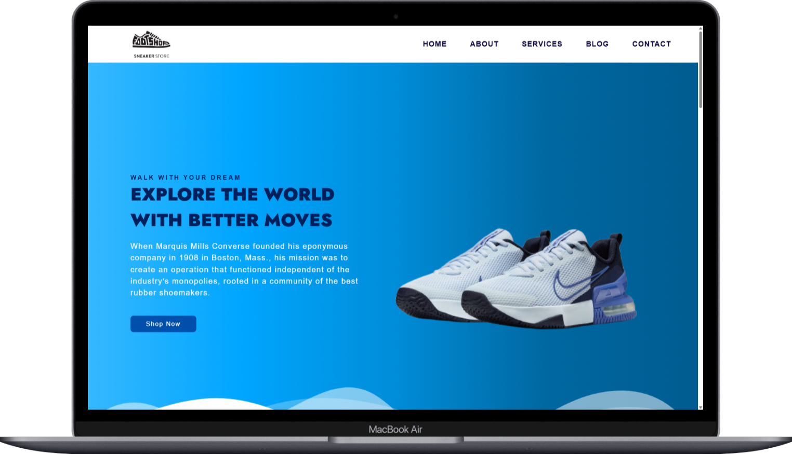
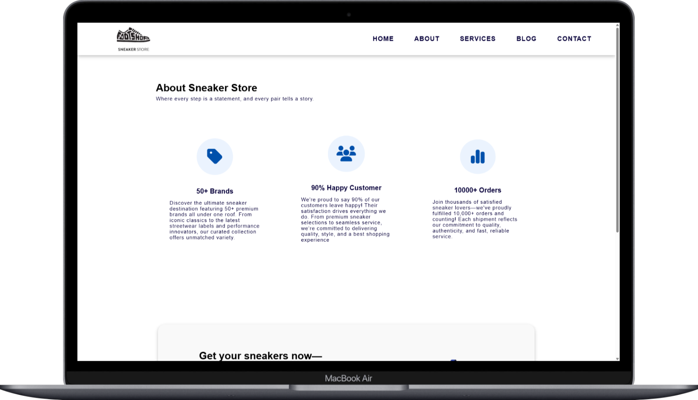
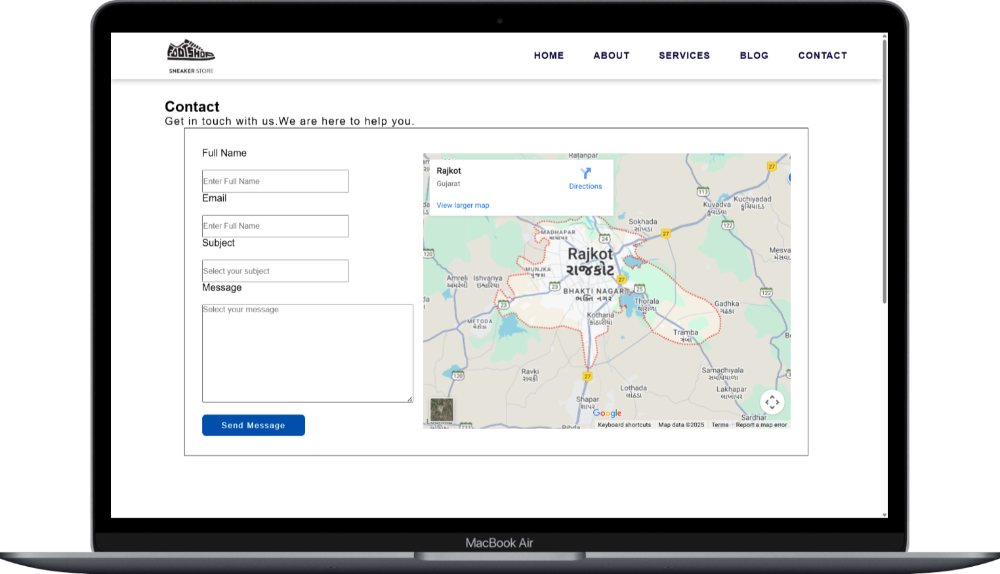
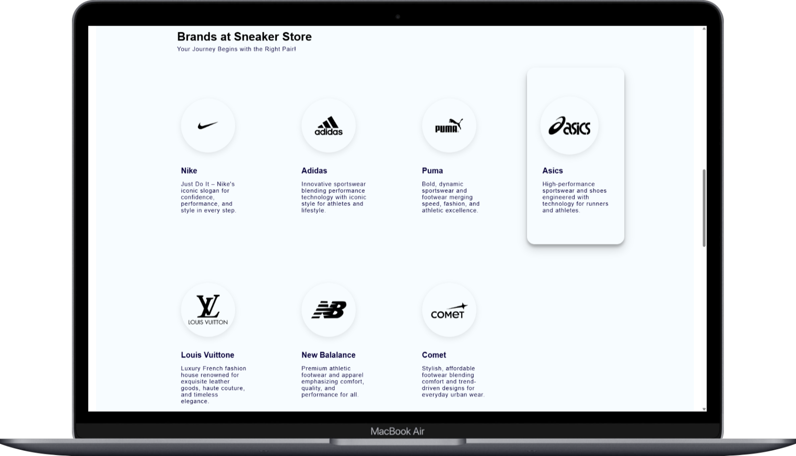

# Walk-With-Dream
# walk-with-dream (Sneaker Store — Landing Page)

  

A responsive static landing page for a fictional sneaker store built with plain HTML & CSS. Features: hero section, brand grid, services, contact form, and responsive layout.

## Demo
**Live demo:** https://<your-github-username>.github.io/walk-with-dream

*(Replace with your actual GitHub Pages URL once deployed.)*

## Pages
- `index.html` — Home / Hero (desktop + mobile)
- `about.html` — About & highlights
- `services.html` — Services / Why choose us
- `blog.html` — Blog (sample posts)
- `contact.html` — Contact form with map

## Tech stack
- HTML5
- CSS3 (flexbox & grid)
- Google Fonts
- Font Awesome

## Features
- Fully responsive layouts (mobile-first)
- Accessible HTML semantics and descriptive alt text
- Contact form (can be connected to Formspree or Netlify Forms)
- Optimized assets (recommendation: use WebP & lazy loading)

## Screenshots
- .
- .
- .
- .
- .


## How to run locally
1. Clone the repo:
   ```bash
   git clone https://github.com/<your-username>/walk-with-dream.git
   cd walk-with-dream
